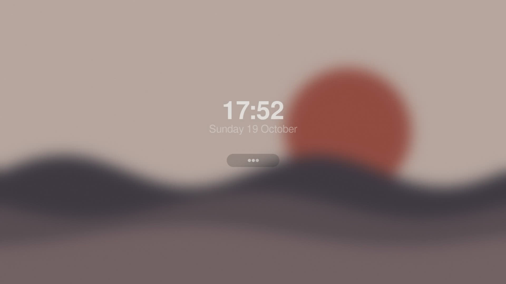
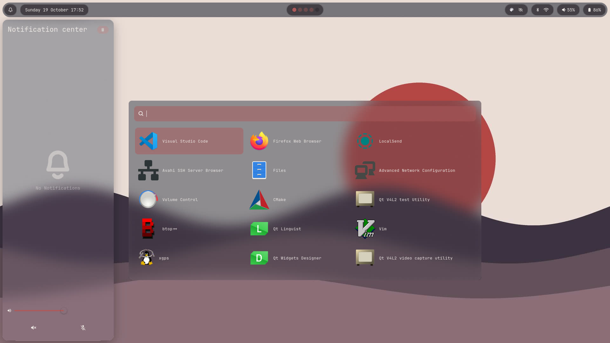
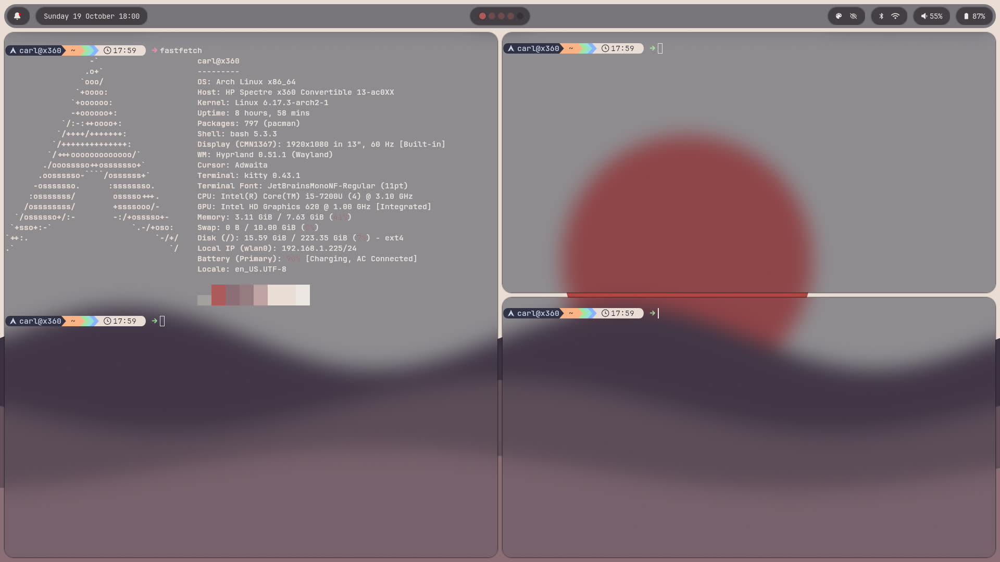
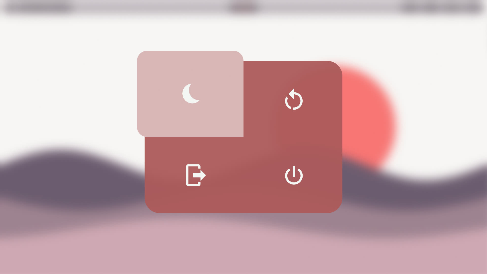

# Hyprland Dotfiles

## Content

- Stowable dotfiles, see `docs/stow.md` for a guide on this.
- Archinstall guide, see `docs/archinstall.md`.
- Hyprland installation guide, see `docs/hyprinstall.md`.
- Configuration guide, see `docs/configuration.md`. E.g., theming, default apps, and
  shortcuts.
- Templates for software configurations.

**Tips**

> Start with the `hyprland.conf`. Make sure the monitors are correctly configured, your
> monitor setup and resolution may differ from mine. If you mouse is slow, increase the
> `sensitivity` value under the `input` block.
>
> See Hyprland binds in `~/.config/hypr/hyprland.conf` for how I control my Window
> manager.

**Caveats**

> There is one CSS import where I use a hardcoded absolute path with my username, see
> `wofi/.config/wofi/style.css`. Adapt this to make it work for you.
>
> Several program configs are dependent on the pywal generated cache files. Make sure to
> stow pywal and run it. `wal -i /path/to/wallpaper -nt` or use my wallpaper script
> `select_wallpaper.sh`. Alternatively, remove the sourcing of pywal themes from the
> configs.
